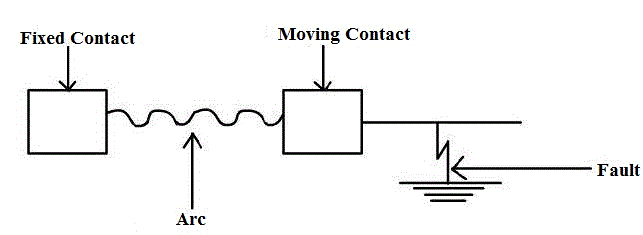

### Circuit Breaker Status Indication from field input

In this experiment, we are indicating the status of the circuit breakers which is located in the field on a human machine interface of workstation with the help of DCS. So let us see the circuit breaker and its working in brief:

<u> **Circuit breakers** </u>  
A circuit breaker is an automatically operated electrical switch designed for to protect an electrical circuit from damage caused by overload or short circuit. Or, in other words, the function of a circuit breaker is to isolate the faulty part of the power system in case of abnormal conditions. A protective relay detects abnormal conditions and sends a tripping signal to the circuit breaker. After receiving the trip command signal from the relay the circuit breaker isolates the faulty part of the power system.

  
fig(a)
Separation of the contacts of the circuit breaker

A circuit breaker has two contacts- a fixed contact and a moving contact.Under normal conditions these two contacts remain in closed position.When the circuit breaker is required to isolate the faulty part, the moving contact moves to interrupt the circuit. On the separation of the contacts,the flow of current is interrupted, resulting in the formation of an arc between the contacts. These contacts are placed in a closed chamber containing some insulating medium (like gas or liquid) which extinguish the arc.

Insulating fluid is used for arc extension and the fluid chosen depends upon the rating and type of circuit breaker. The insulating fluids commonly used for circuit breaker are:

1. Air at atmospheric pressure
2. Compressed air
3. Ultra high vacuum
4. Oil which produces hydrogen for arc extension
5. Sulphur hexafluoride (SF6 )

Some of the gases which have been used in circuit breaker are:

<ul>
<li>Electromagnetic gases : Sulphur hexafluoride , arcton</li>
<li>Simple gases: Air, oxygen, hydrogen, nitrogen and carbon dioxide.</li>
</ul>

The important characteristics of the fluids used in circuit breaker are:

1. It should have good thermal and chemical stability.
2. It should have high declarative strength.
3. Non-inflammability and high thermal conductivity.
4. Arc extinguish ability.

<u>**Classification of circuit breakers**</u>

1. High voltage circuit breakers
2. Low voltage circuit breakers

<u>**High voltage circuit breakers**</u>

1. <u>Oil circuit breakers </u>:-
   1. Bulk oil circuit breakers using a large quantity of oil.
   2. Low oil circuit breakers which operate with a minimum amount of oil.
2. <u>Oil less circuit breakers</u> :-
   1. Hard gas circuit breakers
   2. Air blast circuit breakers
   3. Sulphur hexafluoride circuit breaker
   4. Water circuit breakers
   5. Vacuum circuit breakers

<u>**Characteristics of high voltage rating circuit breaker**</u> :-

1. High voltage rating circuit breaker should have high reliability electrically and mechanically.
2. High voltage rating circuit breaker should be capable of interrupting capacitive and inductive circuits and fault currents of all values within their rating.

Let us see some of the features of major circuit breakers:

(1) <u>OIL CIRCUIT BREAKERS (O.C.B)</u>:  
Oil circuit breakers are the most common and oldest type of circuit breakers. The rating range of circuit breakers lies in range of 25MVA at 2.5kV and 5000MVA at 250kV. In oil circuit breaker, the separating contacts are made to separate within insulating oil medium, which has better insulating properties than air.

<u>Few advantages of using oil as an Arc quenching medium</u>:-

1. Dielectric strength is high
2. As a result of decomposition of oil, it has good cooling property
3. It acts as an insulator between live part and earth
4. Surrounding oil in close proximity to the arc presents a large cooling surface

<u>Few disadvantages</u>:-

1. Highly inflammable and can cause an explosion by mixing with air
2. It requires maintenance
3. Periodic replacement

(2) <u>AIR BLAST CIRCUIT BREAKERS</u>:-  
Air blast circuit breakers is a type of circuit breaker which use a high pressure air blast (at a pressure of 20bar) as an arc quenching medium. Range – 132kV and above up to 400kV ,with the braking capacity up to 7500MVA .But can also be designed to cover the wide range of 66kV to 132kV.

<u>Few advantages</u>:-

1. No risk of explosion and fire hazards
2. Consistent and short arc duration
3. Since the arc duration is short and consistent, the burning of the contact is less due to less arc energy
4. High speed enclosures facility
5. Comparatively less maintenance required

<u>Few disadvantages</u>:-

1. Current chopping
2. Sensitivity to restricting voltage

(3) <u>SULPHUR HEXAFLUORIDE(SF6)CIRCUIT BREAKER</u>:-

Sulphur hexafluoride to other medium such as oil or air for the use in circuit breakers for the following reasons:

1. Being an Inert gas, it is non-reactive to the other components of circuit breakers
2. Sulphur hexafluoride has high dielectric strength (about 24 times that of air and it is comparable to that of oil)
3. When extinction of arc is concerned it is about 100 times more effective than air
4. Its heat transfer property is about 16times that of air because of its high density

<u>Applications</u>:-

1. The circuit breakers are designed for voltages 115kV to 230kV, power rating of 10MVA to 20MVA and interrupting times less than 3cycles.
2. A typical sulphur hexafluoride circuit breaker consist of interrupter units, each capable of dealing with currents up to 60000A and voltage in the range of 50 to 80kV.A number of units are connected in series according to the voltage of the system.

<u>Few Advantages</u>:-

1. No risk of fire
2. No reduction of dielectric strength
3. Arcing time is very short; this reduces the erosion of contact
4. Its operation is very silent
5. The current chopping tendency is minimized by using sulphur hexafluoride gas at low pressure and low velocity
6. The breaker is compact in size and totally enclosed. Thus electrical clearances are drastically reduced and are particularly suitable where explosion hazard exists, like coal mines

<u>Few disadvantages</u>:-

1. Expensive
2. Sulphur hexafluoride gas has to be reconditioned after every operation of the breaker and additional equipment is required for this purpose

(4) <u>VACUUM CIRCUIT BREAKERS(V.C.B)</u>:-  
Vacuum means the pressure below atmospheric pressure which is 760 mm of Hg. In a vacuum circuit breaker, vacuum of the order of 10-5 to 10-7 (1 torr = 1 mm of Hg) is used as the arc quenching medium. The dielectric strength of the vacuum is 1000 times more than that of any other medium.

<u>Applications</u>:-

1. Vacuum breakers are being used for outdoor applications ranging from 22kV to 66kV. They are also suitable for majority of applications in several areas even with limited rating say 60 to 100MVA.
2. Vacuum circuit breakers are used for capacitor-bank switching, transformer, reacting switching, where the voltages are high and current to be interrupted is low.

<u>Few important terms regarding circuit breakers</u>:-

1. <u>Arc voltage</u> :-  
   The voltage across the contacts during the arcing period is known as the 'arc voltage'.

2. <u>Restriking voltage</u>:-  
   The transient voltage appearing across the contacts during arc period is called the 'restriking voltage'.

3. <u>Recovery voltage</u>:-  
   It is normal frequency (50Hz) r.m.s. voltage that appears across the contact of the circuit breaker after the final extinction. It is approximately equal to the system voltage.

4. <u>Rate of Rise of restriking voltage(RRRV)</u>:-  
   The average RRRV = Peak value of restriking voltage/Time taken to reach the peak value

5. <u>Current Chopping</u>:-  
   When low inductive current (e.g. current to a shunt reactor or magnetising current of a transformer) is interrupted by a circuit breaker and the arc quenching force of the circuit breaker is more than necessary to interrupt a low magnitude of current, the current will be interrupted before its manual zero instant. It is termed as current chopping.

<u></u>**Rating of circuit breakers**</u>:-  
A circuit breaker is expected to perform the following duties (besides normal working) under short circuit/fault conditions:

1. To open the contacts to clear the fault and isolating the faulty section.
2. To close the contacts on to a fault.
3. It must be able to carry fault current for a short time while another circuit breaker (in series) is clearing the fault.

Therefore, in addition to the rated voltage, current and frequency, circuit breakers have the following important ratings.

1. Breaking capacity
2. Making capacity
3. Short-time capacity

4. <u>Breaking capacity</u>:-  
   It is the current (r.m.s. value) that a circuit breaker is capable of breaking under specified conditions (e.g. PPPV, power factor) and given recovery voltage.

Where V=Rated service lines in volts,  
I =rated breaking current (symmetrical or asymmetrical) in ampere.

<u>Making capacity</u>:-  
The peak value of current (including the DC component) during first cycle of current wave after the closure of circuit breaker is known as “making capacity”.
Making capacity = 2.55 × symmetrical breaking capacity

<u>Short-time capacity</u>:-  
The short time rating of a circuit breaker depends upon its ability to withstand the temperature rise and the electromagnetic force effects. The oil circuit breakers have a specified limit of 3 seconds when the ratio of symmetrical breaking current to the rated normal current does not exceed 40. However if this ratio exceeds 40, then the specified limit is 1second.

<u>Normal current rating</u>:-  
It is the r.m.s value of current which the circuit breaker is capable of carrying continuously at its rated frequency under specified conditions.

